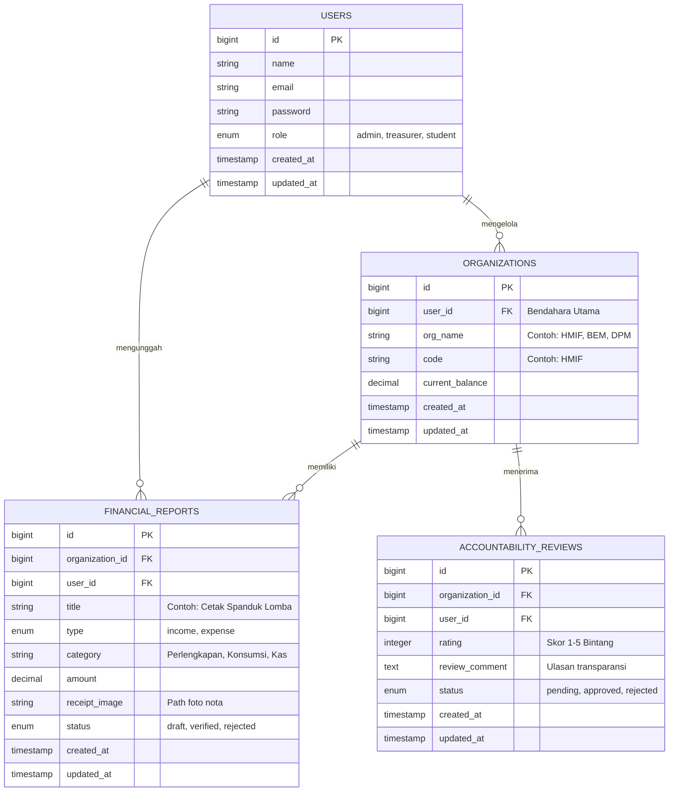

# FundFlow

**FundFlow** adalah platform berbasis web pencatatan keuangan dan pengawasan kinerja terpadu untuk organisasi kemahasiswaan (BEM, DPM, Himpunan, dan UKM). Platform ini memfasilitasi pengurus organisasi untuk mengunggah bukti nota transaksi secara terbuka dan *real-time*, sekaligus memberikan akses publik bagi mahasiswa umum untuk memantau saldo, melihat transparansi alokasi dana, serta menilai akuntabilitas tata kelola ormawa.

---

## 1. Anggota Kelompok

| No | Nama    | NPM    |
|----|--------|--------|
| 1  | Nafarrel | 250013 |
| 2  | Salomo   | 250034 |
| 3  | Rasyid   | 250076 |

---

## 2. Fungsi

Website ini menjadi wadah publik untuk **memantau efektivitas, transparansi, dan akuntabilitas keuangan organisasi kemahasiswaan**. Pengurus organisasi (bendahara) wajib mencatat transaksi pemasukan dan pengeluaran secara terbuka yang dilengkapi dengan unggahan bukti fisik nota/kuitansi. Setiap laporan pengeluaran diproses dan diverifikasi oleh tim pengawas/auditor (DPM) sebelum diterbitkan di direktori publik.

Mahasiswa umum dapat memantau saldo aktif secara *real-time*, melihat visualisasi grafik alokasi anggaran, serta memberikan *review* dan penilaian (*rating*) terhadap akuntabilitas transparansi masing-masing ormawa.

Fitur utama:
- Autentikasi & Authorization multi-role (`admin/auditor`, `treasurer`, `student`).
- Form pencatatan transaksi pemasukan dan pengeluaran kas dilengkapi fitur *upload* foto nota/kuitansi fisik.
- Dashboard pengawasan & verifikasi (*Approve/Reject*) laporan keuangan oleh DPM/Admin.
- Direktori laporan keuangan publik beserta visualisasi grafik (*chart*) alokasi dana per kategori.
- Fitur Ulasan & Rating Akuntabilitas bagi mahasiswa untuk menilai tingkat keterbukaan keuangan ormawa.

---

## 3. Tujuan (memenuhi min. 1 poin SDG)

**SDG 16.6 — Mengembangkan Lembaga yang Efektif, Akuntabel, dan Transparan di Semua Tingkat**

Proyek ini mendukung pencapaian target SDG 16.6 dengan cara:
- **Transparansi Informasi:** Membuka akses penuh bagi seluruh mahasiswa untuk melihat arus kas dan bukti fisik transaksi organisasi secara *real-time*.
- **Akuntabilitas Kelembagaan:** Mendorong pengurus ormawa untuk mengelola anggaran secara tertib dan dapat dipertanggungjawabkan melalui mekanisme verifikasi laporan.
- **Partisipasi Pengawasan Publik:** Memberikan wadah evaluasi berbasis ulasan (*review*) dari mahasiswa guna mengukur tingkat efektivitas dan keterbukaan lembaga kemahasiswaan.

---

## 4. Target Pengguna

| Pengguna | Kebutuhan |
|---|---|
| **Bendahara Organisasi (`treasurer`)** | Menginput data transaksi kas, mengunggah foto kuitansi/nota, dan mengelola alokasi anggaran internal ormawa. |
| **DPM / Admin Pengawas (`admin`)** | Meninjau & memverifikasi validitas kuitansi laporan keuangan, mengelola data ormawa, serta memantau skor akuntabilitas. |
| **Mahasiswa Umum (`student`)** | Memantau saldo aktif, melihat rincian nota transaksi, dan memberikan rating & ulasan transparansi ormawa. |

---

## 5. Mockup Kasar Sederhana

Rancangan tata letak (*wireframe*) sederhana untuk antarmuka web FundFlow:

### Halaman Utama (Public / Student)

```

+-----------------------------------------------------------------------+
|  [Logo] FundFlow       [Direktori] [Peringkat]        [Login/Register]|
+-----------------------------------------------------------------------+
|  HERO: Transparansi Dana Kemahasiswaan Kampus                         |
|  [ Total Kas Terkelola: Rp XX.XXX.XXX ] [ Ormawa Terdaftar: XX ]      |
+-----------------------------------------------------------------------+
|  SEARCH & FILTER: [ Cari Ormawa... (HMIF/BEM) ] [ Filter Kategori v ] |
|                                                                       |
|  +---------------------------+     +---------------------------+      |
|  | Card: HMIF                |     | Card: BEM KEMA            |      |
|  | Saldo: Rp 5.000.000       |     | Saldo: Rp 12.000.000      |      |
|  | Status: Highly Accountable|     | Status: Moderate          |      |
|  | [ Lihat Laporan Kas ]     |     | [ Lihat Laporan Kas ]     |      |
|  +---------------------------+     +---------------------------+      |
+-----------------------------------------------------------------------+
|  FOOTER: FundFlow © 2026 - Supporting SDG 16.6                        |
+-----------------------------------------------------------------------+

```

### Halaman Detail Laporan Ormawa & Input Review

```

+-----------------------------------------------------------------------+
|  HMIF (Himpunan Mahasiswa Informatika) - Laporan Transparansi Kas     |
+-----------------------------------------------------------------------+
|  Saldo Saat Ini: Rp 5.000.000                                         |
|  [ CHART: Visualisasi Alokasi Pengeluaran (Perlengkapan/Konsumsi) ]   |
+-----------------------------------------------------------------------+
|  TABEL TRANSAKSI KAS TERVERIFIKASI:                                   |
|  +------------+--------------------+------------+--------+----------+ |
|  | Tanggal    | Keterangan         | Nominal    | Tipe   | Nota     | |
|  +------------+--------------------+------------+--------+----------+ |
|  | 01/09/2026 | Beli Spanduk Lomba | Rp 250.000 | Keluar | [Lihat]  | |
|  +------------+--------------------+------------+--------+----------+ |
+-----------------------------------------------------------------------+
|  FORM Ulasan Akuntabilitas Mahasiswa:                                 |
|  Rating: [ ★ ★ ★ ★ ☆ ]                                              |
|  Ulasan: [ Masukkan ulasan transparansi kas ormawa ini...           ] |
|  [ Kirim Ulasan ]                                                     |
+-----------------------------------------------------------------------+

```

### Dashboard Management (Admin & Treasurer)

```

+-----------------------------------------------------------------------+
|  DASHBOARD [Treasurer / Admin]                 [ User Profile ] [Logout]|
+-----------------------------------------------------------------------+
|  + Form Input Transaksi Baru (Khusus Treasurer)                       |
|  | Judul Transaksi  : [***]                       |
|  | Tipe Transaksi   : (o) Pemasukan  ( ) Pengeluaran                  |
|  | Nominal (Rp)     : [***]                       |
|  | Upload Foto Nota : [ Choose File... ]                              |
|  | [ Simpan Transaksi ]                                               |
+-----------------------------------------------------------------------+
|  + Tabel Moderasi Verifikasi (Khusus Admin / DPM)                     |
|  | Judul        | Bendahara | Foto Nota | Status   | Aksi             |
|  | Cetak Banner | HMIF      | nota.jpg  | Pending  | [Approve][Reject]|
+-----------------------------------------------------------------------+

```

---

## 6. Skema Database

Minimal 4 tabel: `users`, `organizations`, `financial_reports`, `accountability_reviews`.



**Penjelasan relasi:**

* 1 `users` (role `treasurer`) mengelola 1 `organizations` dan mengunggah banyak `financial_reports`.
* 1 `organizations` memiliki banyak `financial_reports` (pemasukan & pengeluaran).
* 1 `organizations` menerima banyak `accountability_reviews` (ulasan transparansi dari mahasiswa).
* Admin/Auditor (`users` dengan role `admin`) memiliki kewenangan authorization untuk memverifikasi `status` pada `financial_reports` dan memoderasi `accountability_reviews`.

```

```
