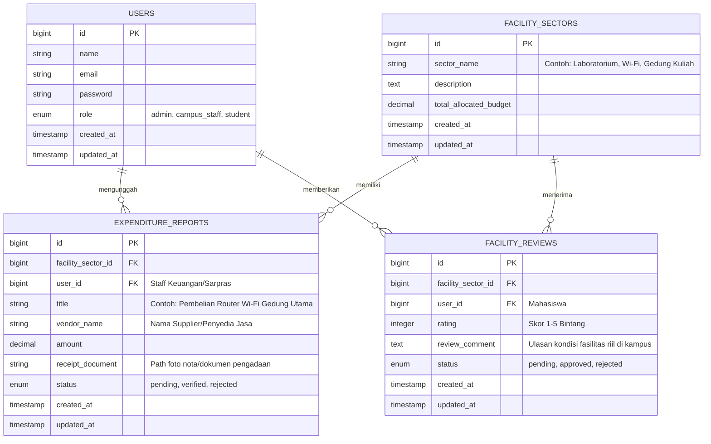

# FundFlow

**FundFlow** adalah platform berbasis web untuk transparansi dan akuntabilitas alokasi dana pendidikan kampus (UKT, IPI, dan dana operasional universitas). Platform ini memfasilitasi pihak pengelola kampus untuk mempublikasikan laporan realisasi anggaran beserta bukti nota/dokumen pengadaan fasilitas secara *real-time*, sekaligus memberikan akses bagi mahasiswa umum untuk melacak aliran dana kampus, memantau kondisi fasilitas, serta menilai kesesuaian antara biaya pendidikan dan fasilitas yang diterima.

---

## 1. Anggota Kelompok

| No | Nama    | NPM    |
|----|--------|--------|
| 1  | Nafarrel | 250013 |
| 2  | Salomo   | 250034 |
| 3  | Rasyid   | 250076 |

---

## 2. Fungsi

Website ini menjadi wadah publik untuk **memantau efektivitas, transparansi, dan akuntabilitas alokasi dana kampus (UKT & IPI) terhadap pembangunan serta pemeliharaan fasilitas universitas**. Pihak pengelola kampus (staf keuangan/sarpras) wajib mengunggah Laporan Realisasi Anggaran (LRA) beserta bukti dokumen pengadaan barang/jasa. Setiap laporan pengeluaran diproses dan diverifikasi oleh tim auditor internal/rektorat sebelum diterbitkan di direktori publik.

Mahasiswa umum dapat melihat grafik persentase alokasi dana UKT (misal: berapa % untuk fasilitas laboratorium, Wi-Fi, gedung, atau kegiatan kampus), melacak bukti pengadaan sarana publik, serta memberikan *review* dan ulasan kesesuaian fasilitas di lapangan.

Fitur utama:
- Autentikasi & Authorization multi-role (`admin/auditor`, `campus_staff`, `student`).
- Form pencatatan alokasi dana dan pemeliharaan fasilitas kampus dilengkapi fitur *upload* foto nota/dokumen pengadaan.
- Dashboard pengawasan & verifikasi (*Approve/Reject*) laporan alokasi anggaran oleh Auditor Kampus/Admin.
- Direktori laporan keuangan publik beserta visualisasi grafik (*chart*) distribusi dana UKT/IPI ke tiap sektor fasilitas.
- Fitur Ulasan & Rating Kelayakan Fasilitas bagi mahasiswa untuk menilai apakah kualitas fasilitas di lapangan sudah sesuai dengan anggaran yang dipublikasikan.

---

## 3. Tujuan (memenuhi min. 1 poin SDG)

**SDG 16.6 — Mengembangkan Lembaga yang Efektif, Akuntabel, dan Transparan di Semua Tingkat**

Proyek ini mendukung pencapaian target SDG 16.6 dengan cara:
- **Transparansi Alokasi Dana:** Membuka akses penuh bagi mahasiswa untuk melihat bukti penggunaan dana UKT/IPI dan pemeliharaan fasilitas kampus secara transparan.
- **Akuntabilitas Lembaga Pendidikan:** Menghindari fenomena "UKT/IPI tinggi namun fasilitas minim" dengan mewajibkan transparansi pengeluaran dan verifikasi audit internal.
- **Partisipasi Pengawasan Mahasiswa:** Memberikan wadah evaluasi berbasis ulasan (*review*) kondisi fasilitas fisik secara *real-time* dari mahasiswa guna mendorong perbaikan fasilitas yang lambat atau terbengkalai.

---

## 4. Target Pengguna

| Pengguna | Kebutuhan |
|---|---|
| **Staf Keuangan/Sarpras Kampus (`campus_staff`)** | Menginput data alokasi pengeluaran dana UKT/IPI, mengunggah foto nota/dokumen pengadaan fasilitas, dan mengelola direktori sarana kampus. |
| **Auditor Kampus / Admin (`admin`)** | Meninjau & memverifikasi validitas kuitansi/dokumen pengadaan fasilitas, mengelola data kategori fasilitas, serta memantau skor akuntabilitas institusi. |
| **Mahasiswa Umum (`student`)** | Memantau persentase alokasi dana UKT/IPI, melihat bukti dokumen pengadaan fasilitas, dan memberikan ulasan/rating kesesuaian fasilitas di kampus. |

---

## 5. Mockup Kasar Sederhana

Rancangan tata letak (*wireframe*) sederhana untuk antarmuka web FundFlow:

### Halaman Utama (Public / Student)

```

+-----------------------------------------------------------------------+
|  [Logo] FundFlow       [Alokasi UKT] [Fasilitas Kampus] [Login/Register]|
+-----------------------------------------------------------------------+
|  HERO: Transparansi Alokasi Dana UKT/IPI & Fasilitas Kampus           |
|  [ Total Dana Terkelola: Rp XXX Miliar ] [ Fasilitas Terdata: XX ]    |
+-----------------------------------------------------------------------+
|  SEARCH & FILTER: [ Cari Fasilitas/Gedung... ] [ Filter Sektor v ]    |
|                                                                       |
|  +---------------------------+     +---------------------------+      |
|  | Sektor: Laboratorium Komp |     | Sektor: Infrastruktur Wi-Fi|      |
|  | Anggaran : Rp 1.500.000.000|     | Anggaran : Rp 800.000.000 |      |
|  | Rating   : ★ ★ ★ ★ ☆      |     | Rating   : ★ ★ ☆ ☆ ☆      |      |
|  | [ Lihat Rincian Pengadaan]|     | [ Lihat Rincian Pengadaan]|      |
|  +---------------------------+     +---------------------------+      |
+-----------------------------------------------------------------------+
|  FOOTER: FundFlow © 2026 - Supporting SDG 16.6                        |
+-----------------------------------------------------------------------+

```

### Halaman Detail Alokasi Sektor & Input Review Fasilitas

```

+-----------------------------------------------------------------------+
|  Alokasi Sektor: Pemeliharaan & Perbaikan Wi-Fi Kampus                |
+-----------------------------------------------------------------------+
|  Total Anggaran Terpakai: Rp 800.000.000                              |
|  [ CHART: Persentase Distribusi Dana UKT per Fakultas ]               |
+-----------------------------------------------------------------------+
|  TABEL DOKUMEN PENGADAAN & MAINTENANCE TERVERIFIKASI:                 |
|  +------------+--------------------+--------------+--------+----------+
|  | Tanggal    | Keterangan         | Nominal      | Tipe   | Dokumen  |
|  +------------+--------------------+--------------+--------+----------+
|  | 12/08/2026 | Upgrade Router GKU | Rp 50.000.000| Keluar | [Lihat]  |
|  +------------+--------------------+--------------+--------+----------+
+-----------------------------------------------------------------------+
|  FORM Ulasan Kualitas Fasilitas Lapangan oleh Mahasiswa:              |
|  Rating Kelayakan : [ ★ ★ ☆ ☆ ☆ ]                                     |
|  Ulasan Fasilitas : [ Masukkan kondisi riil fasilitas di kampus...  ] |
|  [ Kirim Ulasan Fasilitas ]                                           |
+-----------------------------------------------------------------------+

```

### Dashboard Management (Admin & Campus Staff)

```

+-----------------------------------------------------------------------+
|  DASHBOARD [Campus Staff / Admin]             [ User Profile ] [Logout]|
+-----------------------------------------------------------------------+
|  + Form Input Alokasi Anggaran & Pengadaan Baru (Khusus Staff)        |
|  | Judul Pengadaan : [***]                        |
|  | Sektor Fasilitas: [ Laboratorium / Wi-Fi / Gedung / Perpustakaan v]  |
|  | Nominal (Rp)    : [***]                        |
|  | Upload Bukti    : [ Choose File... ] (Nota/Kuitansi Vendor)        |
|  | [ Simpan Pengadaan ]                                               |
+-----------------------------------------------------------------------+
|  + Tabel Moderasi & Audit Dokumen (Khusus Admin / Auditor)            |
|  | Pengadaan     | Sektor   | Bukti Nota | Status   | Aksi            |
|  | Router GKU    | Wi-Fi    | nota.pdf   | Pending  | [Approve][Reject]|
+-----------------------------------------------------------------------+

```

---

## 6. Skema Database

Minimal 4 tabel: `users`, `facility_sectors`, `expenditure_reports`, `facility_reviews`.



**Penjelasan relasi:**

* 1 `users` (role `campus_staff`) mengunggah banyak `expenditure_reports` pengadaan fasilitas kampus.
* 1 `facility_sectors` (misal: Sektor Wi-Fi) memiliki banyak `expenditure_reports` (laporan pengeluaran/maintenance).
* 1 `facility_sectors` menerima banyak `facility_reviews` (ulasan kondisi riil fasilitas dari mahasiswa).
* Admin/Auditor (`users` dengan role `admin`) memiliki kewenangan authorization untuk memverifikasi `status` pada `expenditure_reports` serta memoderasi `facility_reviews`.

```

```
