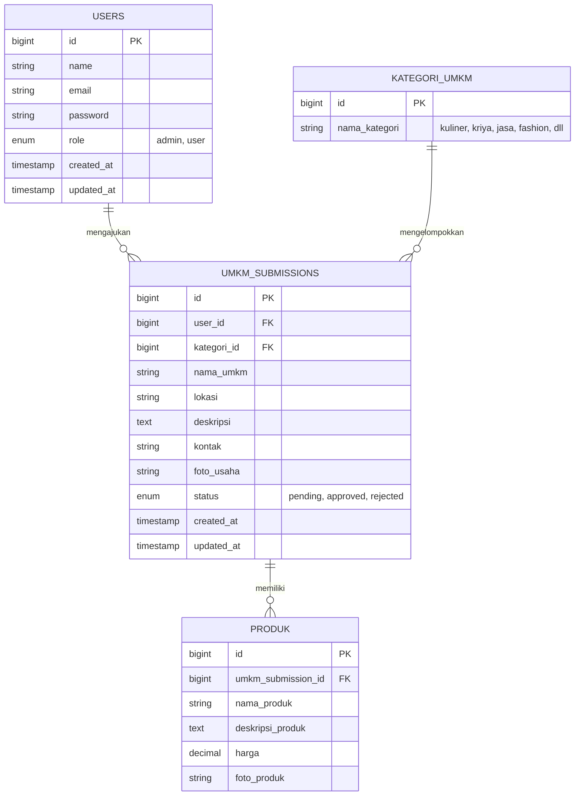

# 

-
---

## 1. Anggota Kelompok

| No | Nama   | NPM    |
|----|--------|--------|
| 1  | Nafarrel | 250013 |
| 2  | Salomo   | 250034 |
| 3  | Rasyid | 250076 |

---

## 2. Fungsi

Website ini menjadi wadah bagi pemilik UMKM untuk **mengajukan promosi usahanya** secara online. Pengajuan yang masuk akan diverifikasi oleh admin sebelum tampil di direktori publik, sehingga informasi yang dipromosikan tetap terjaga kualitas dan keakuratannya. Pengunjung umum dapat menjelajahi direktori UMKM yang sudah disetujui, melihat detail produk/menu, lokasi, dan kontak.

Fitur utama:
- Registrasi & login (autentikasi) untuk pemilik UMKM dan admin
- Form pengajuan promosi UMKM (dengan status pending/approved/rejected)
- Dashboard admin untuk memverifikasi pengajuan (authorization berbasis role)
- Direktori & halaman detail UMKM yang sudah disetujui
- Pencarian/filter UMKM berdasarkan jenis/kategori dan lokasi

---

## 3. Tujuan (SDG)

**SDG 8 — Pekerjaan Layak dan Pertumbuhan Ekonomi**

Proyek ini mendukung poin SDG 8 dengan cara:
- Membuka akses promosi digital yang mudah dan gratis bagi pelaku UMKM, terutama yang belum memiliki kehadiran online.
- Mendorong pertumbuhan ekonomi lokal dengan mempertemukan UMKM dan calon konsumen melalui satu platform terpusat.
- Mendukung penciptaan lapangan kerja tidak langsung melalui peningkatan visibilitas dan potensi penjualan UMKM.

---

## 4. Target Pengguna

| Pengguna | Kebutuhan |
|---|---|
| **Pemilik UMKM** | Mendaftar akun, mengisi form pengajuan promosi, memantau status pengajuan |
| **Admin/Asisten** | Meninjau & memverifikasi (approve/reject) pengajuan UMKM |
| **Masyarakat umum/calon pembeli** | Mencari dan melihat informasi UMKM yang telah dipromosikan |

---

## 5. Skema Database (ERD)

Minimal 4 tabel: `users`, `kategori_umkm`, `umkm_submissions`, `produk`.



**Penjelasan relasi:**
- 1 `users` (role: user/pemilik UMKM) dapat memiliki banyak `umkm_submissions`.
- 1 `kategori_umkm` dapat digunakan oleh banyak `umkm_submissions`.
- 1 `umkm_submissions` dapat memiliki banyak `produk` (menu/produk yang dijual).
- Admin (`users` dengan role `admin`) memiliki akses authorization untuk mengubah `status` pada `umkm_submissions`.

---

## 6. Teknologi

- **Framework:** Laravel 13
- **Autentikasi/Authorization:** Laravel Breeze/Fortify + middleware role (admin/user)
- **Frontend:** Semantic HTML, CSS Framework (Bootstrap/Tailwind), opsional SCSS
- **Database:** MySQL (min. 4 tabel sesuai ERD di atas)

---

## 7. Cara Menjalankan Proyek

```bash
git clone <url-repo>
cd nama-proyek
composer install
cp .env.example .env
php artisan key:generate
# atur koneksi database di .env
php artisan migrate --seed
npm install && npm run dev
php artisan serve
```
